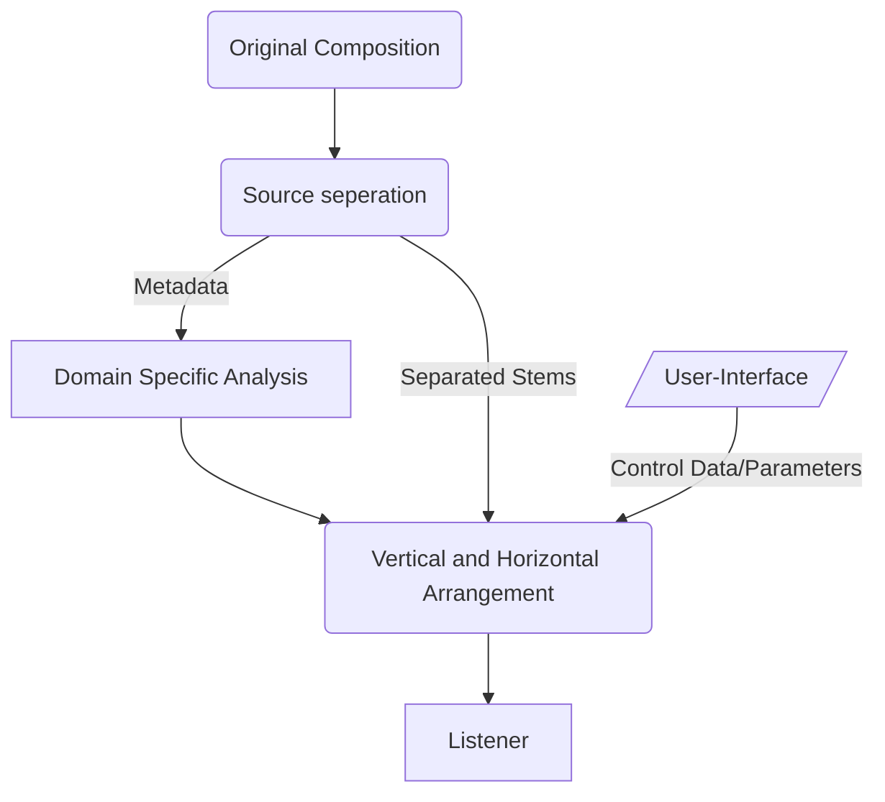
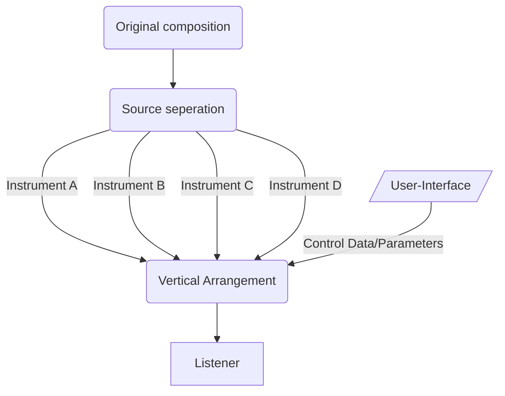
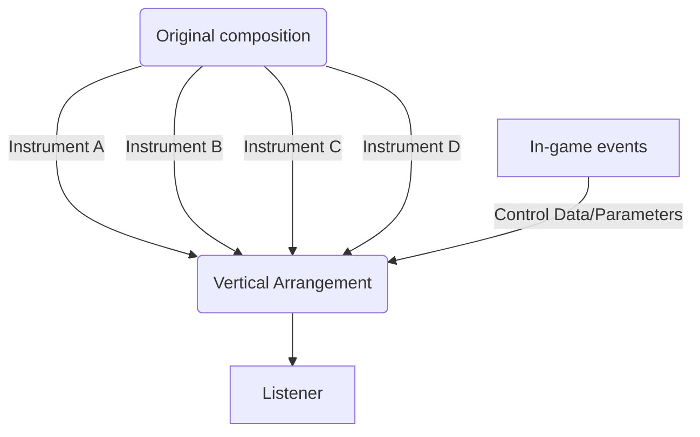
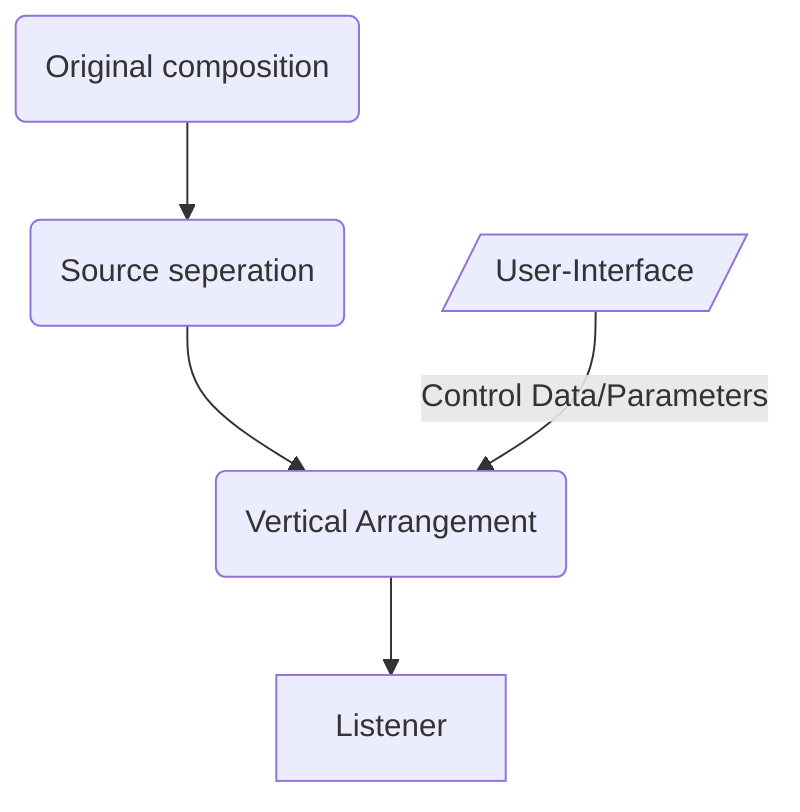

# dynamic-music-rendering
The thesis project for my masters in Sonic Arts at Goldsmiths, UOL. In this project I want to explore the ways in which music endpoints can be made less concrete. 

## My Idea

I am proposing something in the middle?

### Digital rendering system:

### Performer rendering system:

Written Score as system design, conductor as UI 

(TODO: Add more info on systemic/visual scores)

## Paradigms

This project explores how the idea of dynamic music rendering might be applied in a number of contexts.

### Music Consumption

Example: Stem Player (TODO: add link to yeezy/teenage engineering)

Example: Video Game Arranging (TODO: add link to vertical arrangement in video games)

### Music Performance

Example: Horizontal arrangement in Generative FM (TODO: add link to generative fm)

